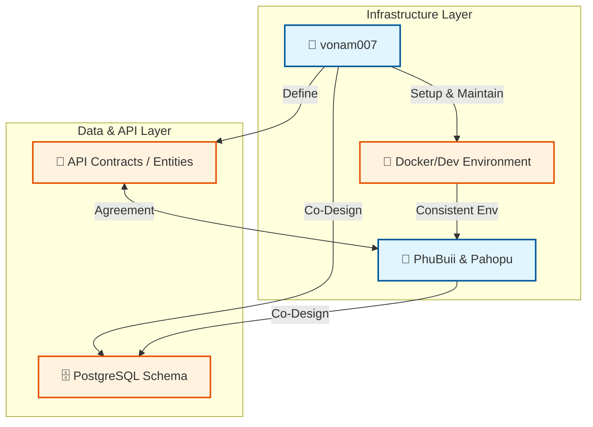

  <!--  -->

  <h1>🦅 Team Canarius</h1>
  
  

    <b>Cự Giải (Cancer) x Nhân Mã (Sagittarius)</b>
  

  
  

    <i>"Xây dựng giải pháp phần mềm hiện đại, ưu tiên kiến trúc Monolith/Microservices, hiệu suất cao và quản lý dữ liệu Real-time."</i>
  

  

    
  

---

## 🦅 1. Giới Thiệu Chung về Team Canarius

**Team Canarius** là đội ngũ phát triển tập trung vào xây dựng các giải pháp phần mềm hiện đại, ưu tiên kiến trúc Monolith/Microservices, hiệu suất cao và quản lý dữ liệu Real-time/API-Driven.

| **Lĩnh vực Tập trung** | **Công nghệ Cốt lõi**                                 | **Tư duy Phát triển**                                                            |
| :--------------------- | :---------------------------------------------------- | :------------------------------------------------------------------------------- |
| **Backend Core**       | Golang, PostgreSQL, Hasura (GraphQL), RESTFul, NestJS | API-First, Performance Optimization                                              |
| **Frontend Core**      | Next.js/React, TypeScript, Tailwind, React Query      | Component System, SSR/Caching, UX-Centric                                        |
| **Infrastructure**     | Docker, Docker Compose, CI/CD                         | Infrastructure as Code, Containerization                                         |
| **Tên Team**           | **Canarius**                                          | Lấy cảm hứng từ sự nhanh nhẹn, khả năng phát hiện sớm vấn đề (Cự Giải x Nhân Mã) |

---

## 👤 2. Thành Viên

<table align="center">
  <tr>
    <td align="center" width="33%">
      <a href="https://github.com/vonam007">
         
        <b>vonam007</b>
      </a> 
      <code>Backend Core & DevOps</code>
    </td>
    <td align="center" width="33%">
      <a href="https://github.com/PhuBuii">
         
        <b>PhuBuii</b>
      </a> 
      <code>Frontend Core</code>
    </td>
    <td align="center" width="33%">
      <a href="https://github.com/Pahopu">
         
        <b>Pahopu</b>
      </a> 
      <code>Frontend Core</code>
    </td>
  </tr>
</table>

## 👤 3. Chuyên Môn Cốt Lõi

Mô tả vai trò và chuyên môn của các nhóm phát triển:

### 🛠️ 1. Team Backend (Thành viên: vonam007)

> **Trọng tâm:** Xây dựng API cốt lõi, xử lý logic nghiệp vụ phức tạp và giao tiếp dữ liệu nội bộ.

- **Backend Developer:**
  - _Chuyên môn:_ Golang/NestJS (Thiết kế Microservices hiệu suất cao), Hasura (GraphQL API Gateway, Real-time Data).
- **DevOps:**
  - _Chuyên môn:_ Docker, Docker Compose (Containerization), PostgreSQL.
  - _Nhiệm vụ:_ Quản lý môi trường phát triển (Dev Environment), tối ưu hóa quy trình CI/CD.

### 🎨 2. Team Frontend (Thành viên: PhuBuii, Pahopu)

> **Trọng tâm:** Xây dựng nền tảng, chuyển đổi thiết kế thành code và đảm bảo trải nghiệm người dùng.

- **Frontend Architect:**
  - _Chuyên môn:_ Next.js/React, TypeScript, Testing Frameworks.
  - _Nhiệm vụ:_ Xây dựng nền tảng (Foundation), cấu hình SSR/Caching, đảm bảo hiệu suất render.
- **UI/UX Implementation:**
  - _Chuyên môn:_ Component System, State/Data Flow (React Query/Zustand), Styling (Tailwind/Shadcn).
  - _Nhiệm vụ:_ Đảm bảo tính thẩm mỹ và khả năng đáp ứng (Responsive) của giao diện.

---

## 🤝 3. Quy Trình Phối Hợp và Điểm Mạnh Tập Thể

### 🔄 Phối hợp Liên chức năng (Cross-Functional Collaboration)

